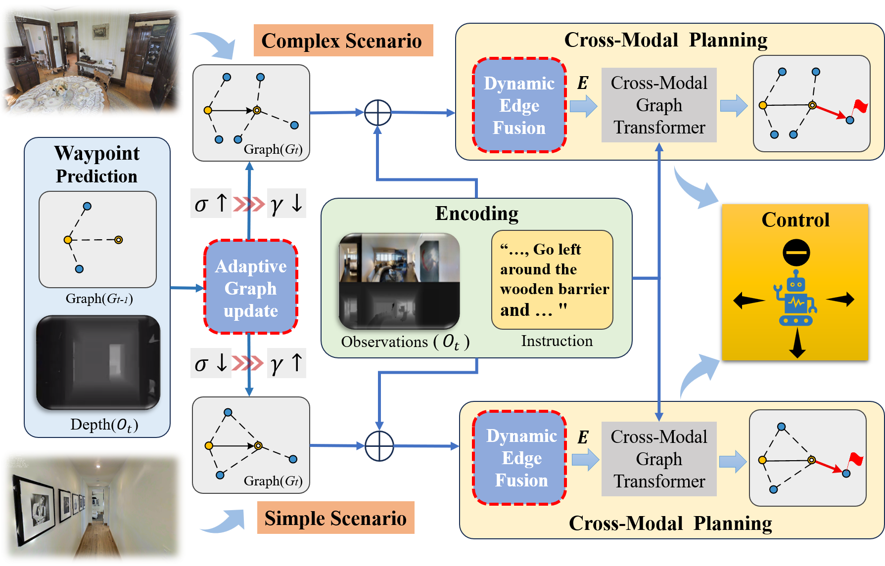
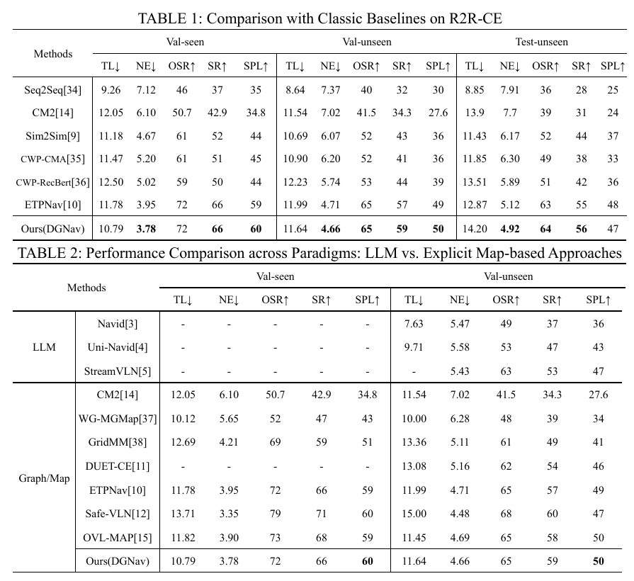

# **Dynamic Topology Awareness: Breaking the Granularity Rigidity in Vision-Language Navigation**

## Abstract

Vision-Language Navigation in Continuous Environments (VLN-CE) presents a core challenge: grounding high-level linguistic instructions into precise, safe, and long-horizon spatial actions. While recent Large Language Model (LLM) based approaches demonstrate impressive reasoning capabilities, explicit topological maps remain a vital solution for their robust spatial memory. However, existing topological planning methods suffer from a "Granularity Rigidity" problem: Fixed construction thresholds and sole geometric metrics lead to a misalignment between topological granularity and environmental complexity: the inability to dynamically modulate sampling density based on environmental uncertainty results in inefficiency within simple regions and sparse sampling in high-uncertainty areas, thereby compromising navigational precision. To address this, we propose DGNav, a framework that introduces Dynamic Topology Awareness for flexible navigation. Specifically, we first propose a Scene-Aware Adaptive Strategy, which dynamically modulates the graph construction threshold based on the dispersion of predicted waypoints, ensuring adaptive node density (i.e., "densification on demand"). Furthermore, we design a Dynamic Graph Transformer that reconstructs graph connectivity by fusing visual, linguistic, and geometric cues into dynamic edge weights, enabling the agent to filter out topological noise and enhance instruction adherence. Extensive experiments demonstrate that DGNav significantly outperforms the strong baseline (ETPNav) on R2R-CE, achieving a 58.56% Success Rate (SR) and 50.08% SPL in unseen environments. On the RxR-CE dataset, characterized by longer instructions and more complex path trajectories, DGNav excels in instruction fidelity, achieving 62.04% nDTW and 44.49% SDTW.

<video src="./assets/DGNav.mp4"></video>



## Setup

### Installation

1. This project is developed with Python 3.7. If you are using [miniconda](https://docs.conda.io/en/latest/miniconda.html) or [anaconda](https://anaconda.org/), you can create an environment:

```bash
conda create -n vlnce python=3.7
conda activate vlnce
```

2. Install [habitat-sim](https://anaconda.org/aihabitat/habitat-sim/0.1.7/download/linux-64/habitat-sim-0.1.7-py3.7_headless_linux_856d4b08c1a2632626bf0d205bf46471a99502b7.tar.bz2) with the corresponding Python version and headless mode:

```bash
conda install habitat-sim-0.1.7-py3.7_headless_linux_856d4b08c1a2632626bf0d205bf46471a99502b7.tar.bz2
```

3. Then install [Habitat-Lab](https://github.com/facebookresearch/habitat-lab/tree/v0.1.7):

​	**Notice:** You need to comment out the TensorFlow line in `habitat_baselines/rl/requirements.txt`.

```bash
git clone --branch v0.1.7 git@github.com:facebookresearch/habitat-lab.git
cd habitat-lab
# installs both habitat and habitat_baselines
python -m pip install -r requirements.txt
python -m pip install -r habitat_baselines/rl/requirements.txt
python -m pip install -r habitat_baselines/rl/ddppo/requirements.txt
python setup.py develop --all
```

4. Clone this repository and install all requirements for `habitat-lab`, VLN-CE and our experiments. Note that we specify `gym==0.21.0` because its latest version is not compatible with `habitat-lab-v0.1.7`.

```bash
git clone git@github.com:shannanshouyin/DGNav.git
cd DGNav
pip install torch==1.9.1+cu111 torchvision==0.10.1+cu111 -f https://download.pytorch.org/whl/torch_stable.html
pip install git+https://github.com/openai/CLIP.git
pip install gym==0.21.0
python -m pip install -r requirements.txt
```

### Scenes: Matterport3D

Instructions copied from [VLN-CE](https://github.com/jacobkrantz/VLN-CE):

Matterport3D (MP3D) scene reconstructions are used. The official Matterport3D download script (`download_mp.py`) can be accessed by following the instructions on their [project webpage](https://niessner.github.io/Matterport/). The scene data can then be downloaded:

```bash
# requires running with python 2.7
python download_mp.py --task habitat -o data/scene_datasets/mp3d/
```

Extract such that it has the form `scene_datasets/mp3d/{scene}/{scene}.glb`. There should be 90 scenes. Place the `scene_datasets` folder in `data/`.

### Data and Trained Weights

* Waypoint Predictor: `data/wp_pred/check_cwp_bestdist*`

  * For R2R-CE, `data/wp_pred/check_cwp_bestdist_hfov90` [[link]](https://drive.google.com/file/d/1goXbgLP2om9LsEQZ5XvB0UpGK4A5SGJC/view?usp=sharing).
  * For RxR-CE, `data/wp_pred/check_cwp_bestdist_hfov63 `[[link]](https://drive.google.com/file/d/1LxhXkise-H96yMMrTPIT6b2AGjSjqqg0/view?usp=sharing) `(modify the suffix to hfov63)`.

* Pre-trained weights follow ETPNav [[link]](https://drive.google.com/file/d/1MWR_Cf4m9HEl_3z8a5VfZeyUWIUTfIYr/view?usp=share_link).

* Processed data,fine-tuned weight is coming soon.

  ```
  unzip etp_ckpt.zip    # file/fold structure has been organized
  ```

  overall, files and folds are organized as follows:

  ```
  ETPNav
  ├── data
  │   ├── datasets
  │   ├── logs
  │   ├── scene_datasets
  │   └── wp_pred
  └── pretrained
      └── ETP
  ```

## Running

1. Pre-training(the same one used in [ETPNav](https://github.com/MarSaKi/ETPNav))

​	Download the pretraining datasets [[link]](https://www.dropbox.com/sh/u3lhng7t2gq36td/AABAIdFnJxhhCg2ItpAhMtUBa?dl=0)  and precomputed features [[link]](https://drive.google.com/file/d/1D3Gd9jqRfF-NjlxDAQG_qwxTIakZlrWd/view?usp=sharing), unzip in folder `pretrain_src`

```
CUDA_VISIBLE_DEVICES=0,1 bash pretrain_src/run_pt/run_r2r.bash 2333
```

2. Fine-tuning and Evaluation

​	Use `main.bash` for `Training/Evaluation/Inference with a single GPU or with multiple GPUs on a single node.` Simply adjust the arguments of the bash scripts:

```
# for R2R-CE
CUDA_VISIBLE_DEVICES=0,1 bash run_r2r/main.bash train 2333  # training
CUDA_VISIBLE_DEVICES=0,1 bash run_r2r/main.bash eval  2333  # evaluation
CUDA_VISIBLE_DEVICES=0,1 bash run_r2r/main.bash infer 2333  # inference
```

```
# for RxR-CE
CUDA_VISIBLE_DEVICES=0,1 bash run_rxr/main.bash train 2333  # training
CUDA_VISIBLE_DEVICES=0,1 bash run_rxr/main.bash eval  2333  # evaluation
CUDA_VISIBLE_DEVICES=0,1 bash run_rxr/main.bash infer 2333  # inference
```

## Acknowledge

Our implementations are partially inspired by and [DUET](https://github.com/cshizhe/VLN-DUET) and [ETPNav](https://github.com/MarSaKi/ETPNav).

Thanks for their great works!

## Performance Demonstration


