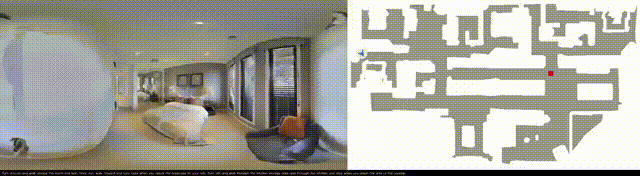
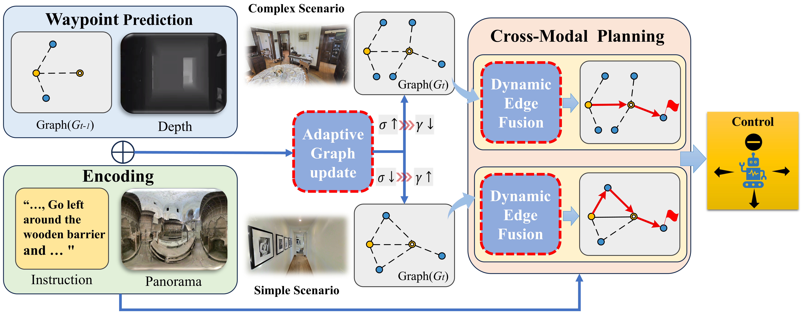

# DGNav: Dynamic Topology-Aware Planning for Vision-Language Navigation in Continuous Environments



[Paper]: https://arxiv.org/abs/2601.21751

## Abstract

Vision-Language Navigation in Continuous Environments (VLN-CE) requires an agent to follow natural-language instructions while maintaining spatial memory for long-horizon decision making. Recent explicit-map methods address this problem by building online topological graphs, but they commonly rely on fixed geometric rules for node merging and graph reasoning. Such fixed topology construction may be suboptimal across different local structures, since simple regions and ambiguous branching regions often require different graph granularities. To address this issue, we propose DGNav, a dynamic topology-aware planning framework for VLN-CE. DGNav contains two complementary components. First, an adaptive graph update strategy adjusts the node-merging threshold according to the angular dispersion of predicted waypoints, allowing the online topology to maintain a compact representation in simple regions while preserving more local candidates in ambiguous regions. Second, an aware-GASA planner introduces geometric, visual, and instruction-aware residual biases into graph self-attention, encouraging the planner to reason over both physical reachability and task-relevant semantic cues. Experiments on R2R-CE and RxR-CE show that DGNav brings consistent improvements over the explicit topological baseline. Further ablations verify the individual contributions of adaptive graph updating and aware-GASA, showing that improving both graph construction and graph reasoning is beneficial for long-horizon VLN-CE.



### Installation

1. This project is developed with Python 3.7. If you are using [miniconda](https://docs.conda.io/en/latest/miniconda.html) or [anaconda](https://anaconda.org/), you can create an environment:

```bash
conda create -n vlnce python=3.7
conda activate vlnce
```

2. Install [habitat-sim](https://anaconda.org/aihabitat/habitat-sim/0.1.7/download/linux-64/habitat-sim-0.1.7-py3.7_headless_linux_856d4b08c1a2632626bf0d205bf46471a99502b7.tar.bz2) with the corresponding Python version and headless mode:

```bash
conda install habitat-sim-0.1.7-py3.7_headless_linux_856d4b08c1a2632626bf0d205bf46471a99502b7.tar.bz2
```

3. Then install [Habitat-Lab](https://github.com/facebookresearch/habitat-lab/tree/v0.1.7):

​	**Notice:** You need to comment out the TensorFlow line in `habitat_baselines/rl/requirements.txt`.

```bash
git clone --branch v0.1.7 git@github.com:facebookresearch/habitat-lab.git
cd habitat-lab
# installs both habitat and habitat_baselines
python -m pip install -r requirements.txt
python -m pip install -r habitat_baselines/rl/requirements.txt
python -m pip install -r habitat_baselines/rl/ddppo/requirements.txt
python setup.py develop --all
```

4. Clone this repository and install all requirements for `habitat-lab`, VLN-CE and our experiments. Note that we specify `gym==0.21.0` because its latest version is not compatible with `habitat-lab-v0.1.7`.

```bash
git clone git@github.com:shannanshouyin/DGNav.git
cd DGNav
pip install torch==1.9.1+cu111 torchvision==0.10.1+cu111 -f https://download.pytorch.org/whl/torch_stable.html
pip install git+https://github.com/openai/CLIP.git
pip install gym==0.21.0
python -m pip install -r requirements.txt
```

### Scenes: Matterport3D

Instructions copied from [VLN-CE](https://github.com/jacobkrantz/VLN-CE):

Matterport3D (MP3D) scene reconstructions are used. The official Matterport3D download script (`download_mp.py`) can be accessed by following the instructions on their [project webpage](https://niessner.github.io/Matterport/). The scene data can then be downloaded:

```bash
# requires running with python 2.7
python download_mp.py --task habitat -o data/scene_datasets/mp3d/
```

Extract such that it has the form `scene_datasets/mp3d/{scene}/{scene}.glb`. There should be 90 scenes. Place the `scene_datasets` folder in `data/`.

### Data and Trained Weights

Waypoint Predictor: `data/wp_pred/check_cwp_bestdist*`

* For R2R-CE, `data/wp_pred/check_cwp_bestdist_hfov90` [[link]](https://drive.google.com/file/d/1goXbgLP2om9LsEQZ5XvB0UpGK4A5SGJC/view?usp=sharing).
* For RxR-CE, `data/wp_pred/check_cwp_bestdist_hfov63 `[[link]](https://drive.google.com/file/d/1LxhXkise-H96yMMrTPIT6b2AGjSjqqg0/view?usp=sharing) `(modify the suffix to hfov63)`.


## Running

1. Pre-training(the same one used in [ETPNav](https://github.com/MarSaKi/ETPNav))

​	Download the pretraining datasets [[link]](https://www.dropbox.com/sh/u3lhng7t2gq36td/AABAIdFnJxhhCg2ItpAhMtUBa?dl=0)  and precomputed features [[link]](https://drive.google.com/file/d/1D3Gd9jqRfF-NjlxDAQG_qwxTIakZlrWd/view?usp=sharing), unzip in folder `pretrain_src`

```
CUDA_VISIBLE_DEVICES=0,1 bash pretrain_src/run_pt/run_r2r.bash 2333
```

2. Fine-tuning and Evaluation

​	Use `main.bash` for `Training/Evaluation/Inference with a single GPU or with multiple GPUs on a single node.` Simply adjust the arguments of the bash scripts:

```
# for R2R-CE
CUDA_VISIBLE_DEVICES=0,1 bash run_r2r/main.bash train 2333  # training
CUDA_VISIBLE_DEVICES=0,1 bash run_r2r/main.bash eval  2333  # evaluation
```

```
# for RxR-CE
CUDA_VISIBLE_DEVICES=0,1 bash run_rxr/main.bash train 2333  # training
CUDA_VISIBLE_DEVICES=0,1 bash run_rxr/main.bash eval  2333  # evaluation
```

## Acknowledge

Our implementations are partially inspired by and [DUET](https://github.com/cshizhe/VLN-DUET) and [ETPNav](https://github.com/MarSaKi/ETPNav).

Thanks for their great works!

